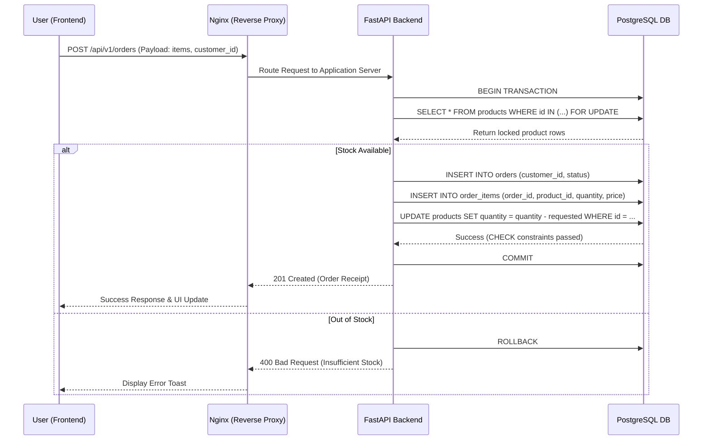
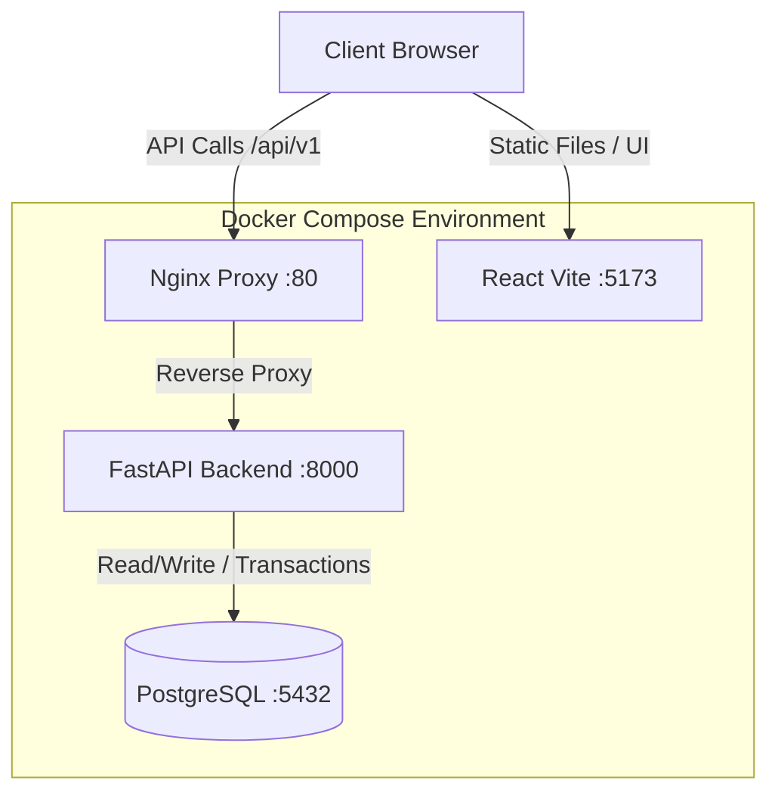

# Quantum Inventory & Order Management System

A production-ready, fully containerized full-stack application built with a **Python FastAPI** backend, a **PostgreSQL** database, and a **React** (Vite) frontend.

---

## 🏗️ Architectural Overview (Principal Level)

Rather than using generic boilerplates, this project incorporates enterprise-grade patterns for concurrency, integrity, and containerization.

### 1. Concurrency & Integrity Safeguards
* **Pessimistic Locking**: When placing an order, the system locks product inventory rows in PostgreSQL (`SELECT ... FOR UPDATE`) inside an atomic transaction. This prevents concurrent shoppers from checking out the same inventory simultaneously (solving race conditions).
* **Database Check Constraint**: The database schema contains a hard `CHECK (quantity >= 0)` constraint on the products table. If a concurrent update attempts to drop stock below zero, PostgreSQL immediately rolls back the transaction.
* **Captured Prices**: Orders record detailed product listings in a one-to-many relationship with `order_items`, capturing the `unit_price` at purchase time to protect invoice integrity against future catalog price updates.

### 2. DevOps & Containerization
* **Multi-stage Builds**: Production Dockerfiles minimize image footprint sizes (using python slim and node build patterns) and execute utilizing non-root system users to minimize security attack surfaces.
* **Orchestration**: The system provides two separate configurations:
  * `docker-compose.yml`: Tailored for production Nginx serving and optimized image caching.
  * `docker-compose.dev.yml`: Configured with mounted local workspace volumes to support live reload environments (FastAPI and Vite) for developer productivity.

---

## 🔄 Complete System & Execution Flow

To understand the complete lifecycle of a request in the Quantum Inventory System, below is the end-to-end execution flow illustrating how the frontend, backend, and database interact during a critical operation (like placing an order).

### 1. Order Placement & Concurrency Flow



### 2. Containerization & Orchestration Flow



This ensures zero downtime and complete isolation of services, with Nginx acting as the primary gatekeeper for production traffic.

---

## 🛠️ Quick Start (Local Development)

To run the application with **hot-reloading enabled**:

### 1. Build and Launch Containers
```bash
docker compose -f docker-compose.dev.yml up --build
```
This command spins up:
* **PostgreSQL Database** on port `5432`
* **FastAPI Backend API** on port `8000`
* **Vite React Frontend** on port `5173`

### 2. Seed Mock Database Data
To populate the database with mock customers, products (including out-of-stock and low-stock categories), and previous orders, execute the seeder script inside the running API container:
```bash
docker exec -it inventory_backend_dev python seed.py
```

### 3. Access Interfaces
* **Frontend Dashboard**: Navigate to [http://localhost:5173](http://localhost:5173)
* **Backend API Docs (Swagger UI)**: Navigate to [http://localhost:8000/docs](http://localhost:8000/docs)
* **API JSON Health Check**: Navigate to [http://localhost:8000/](http://localhost:8000/)

---

## 🚀 Production Build & Deployment

To build and run the production containers:
```bash
docker compose up --build
```
In this mode, the frontend is served as static files via an optimized **Nginx** reverse proxy running on port `80`.

---

## 🧬 API Documentation

All routes are versioned under `/api/v1`.

### Products (`/api/v1/products`)
* `POST /` - Register a new product catalog item
* `GET /` - List all products (supports fuzzy search queries `?search=`)
* `GET /{id}` - Retrieve a single product by UUID
* `PUT /{id}` - Update name, price, stock levels, or SKU code
* `DELETE /{id}` - Unregister product

### Customers (`/api/v1/customers`)
* `POST /` - Register a new client profile (requires unique email address)
* `GET /` - List all registered customers (supports query filters)
* `GET /{id}` - View customer profile details
* `DELETE /{id}` - Delete customer profile

### Orders (`/api/v1/orders`)
* `POST /` - Place a new multi-product order. Decrements stock levels inside atomic SQL transactions
* `GET /` - List transaction history (loads associated customer and line items)
* `GET /{id}` - Retrieve detailed invoice breakdown
* `DELETE /{id}` - Cancel order and restore products back into inventory stock levels

### Dashboard (`/api/v1/dashboard`)
* `GET /` - Aggregate total products, active customers, order volumes, and list critical low-stock warnings (quantity < 10)
