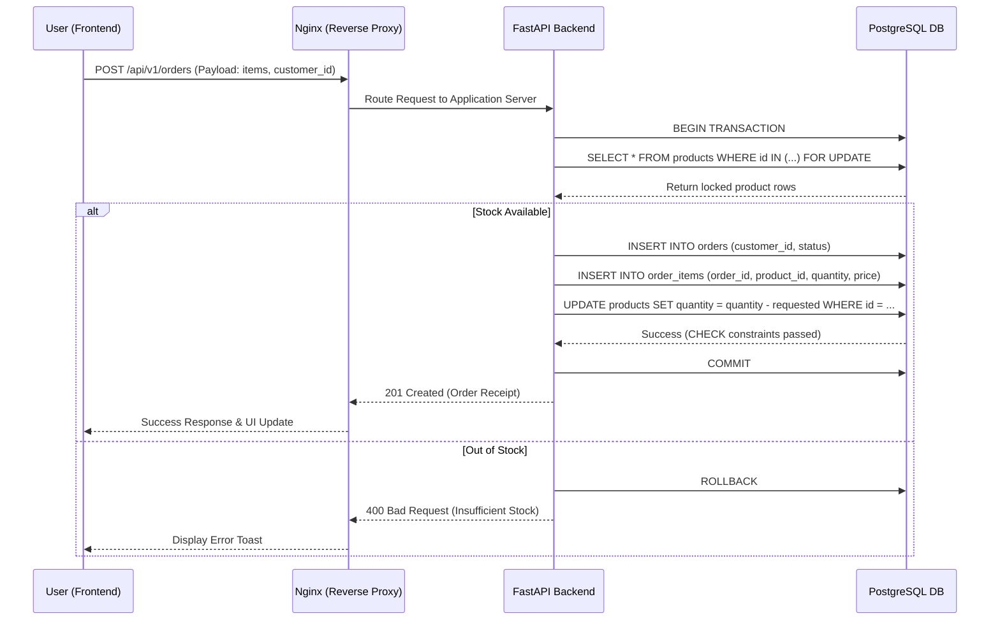
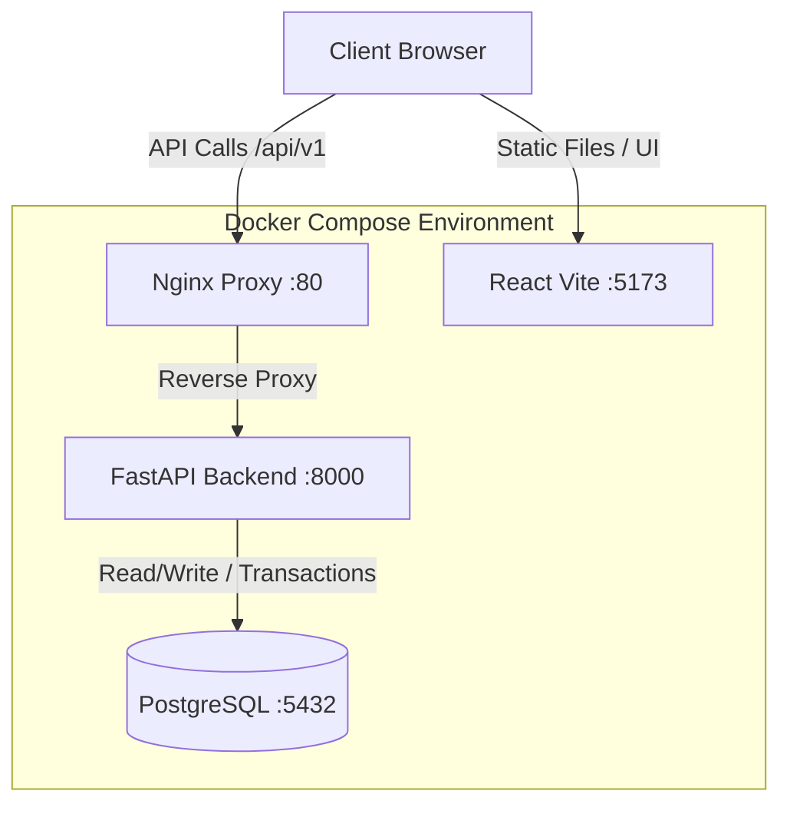
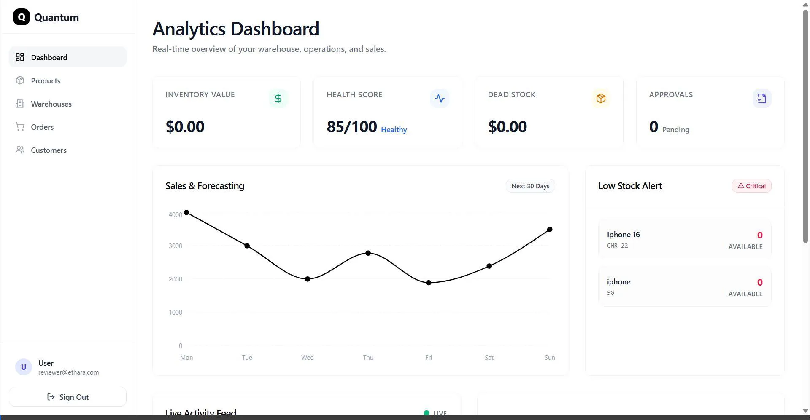
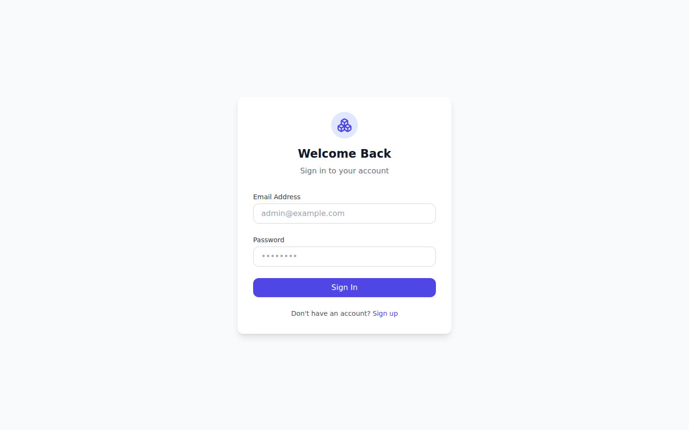
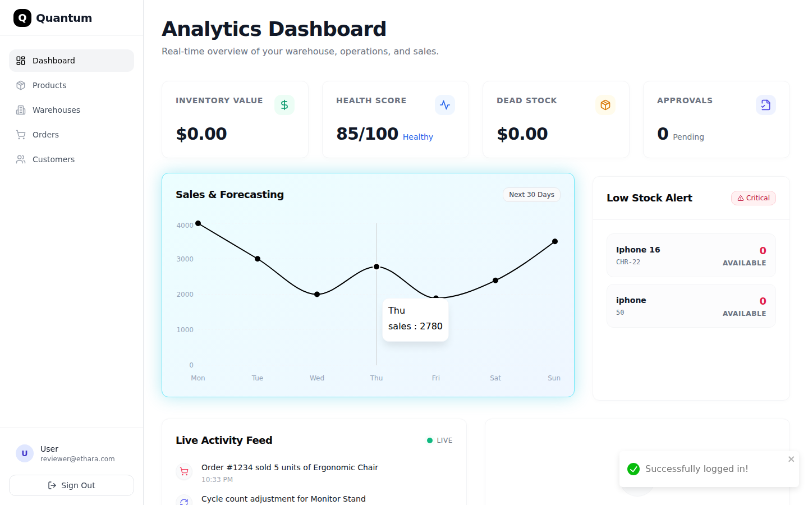
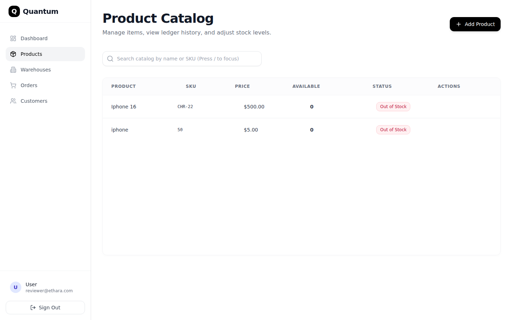
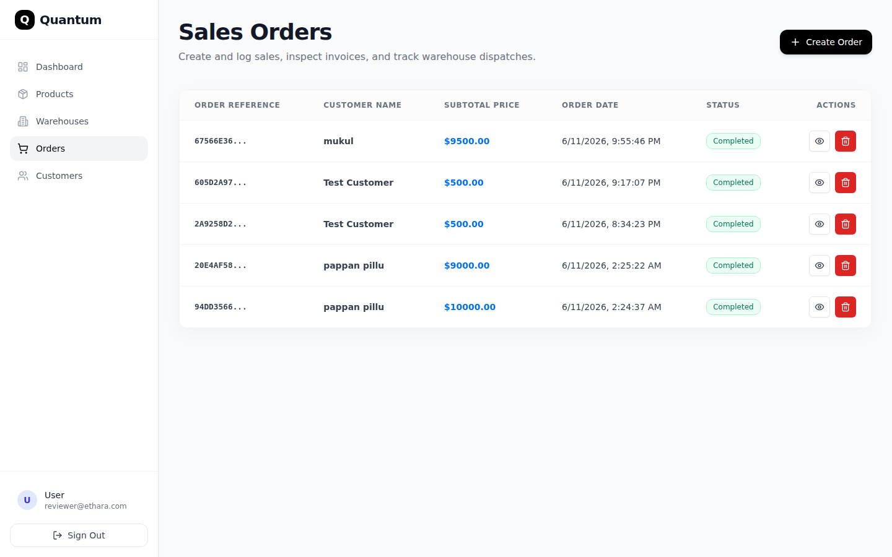
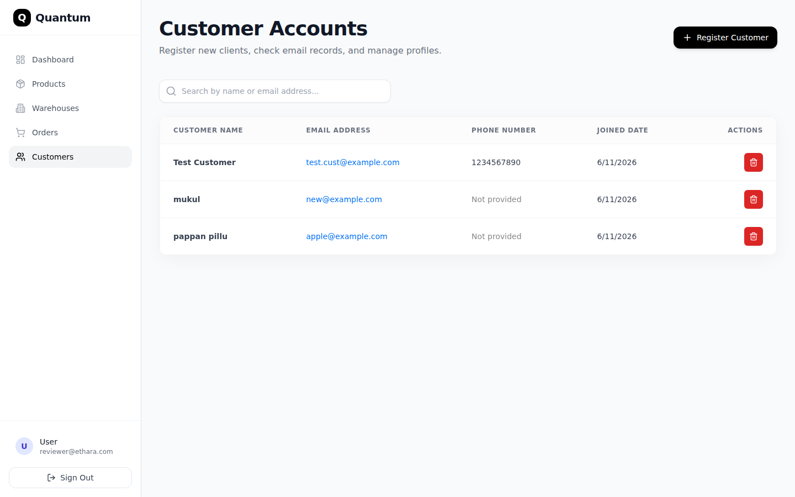
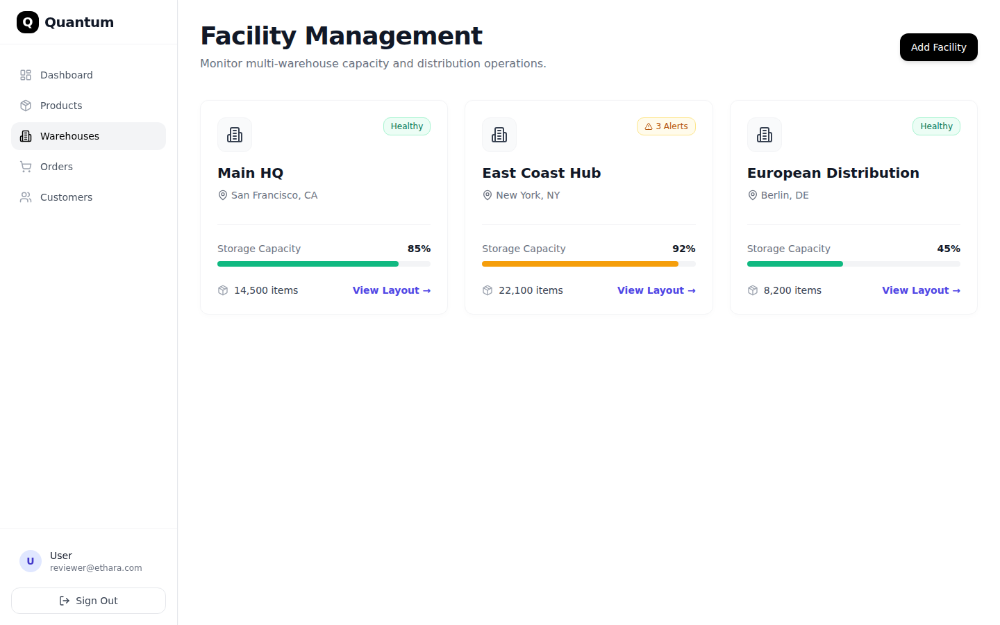
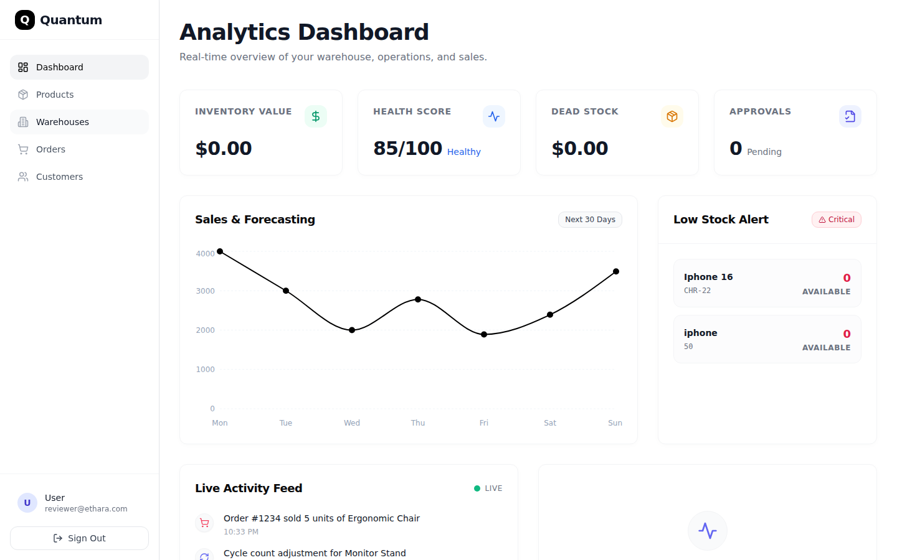

# Quantum Inventory & Order Management System

A containerized full-stack application built with a **Python FastAPI** backend, a **PostgreSQL** database, and a **React** (Vite) frontend.

---

## 🏗️ System Architecture

This project implements a double-entry ledger-based inventory system with concurrency controls, database check constraints, and Docker orchestration.

### 1. Concurrency & Integrity
* **Pessimistic Locking**: When placing an order, the system locks product inventory rows in PostgreSQL (`SELECT ... FOR UPDATE`) inside an atomic transaction. This prevents concurrent shoppers from checking out the same inventory simultaneously.
* **Database Check Constraint**: The database schema contains a hard `CHECK (after_value >= 0)` constraint on the `inventory_events` ledger table. If any concurrent update or adjustment attempts to drop stock below zero, PostgreSQL rolls back the transaction.
* **Captured Prices**: Orders record detailed product listings in `order_items`, capturing the `unit_price` at purchase time to protect invoice integrity against future catalog price updates.

### 2. Deployment & Containerization
* **Multi-stage Builds**: Production Dockerfiles minimize image footprint sizes and execute using non-root system users to minimize security risk.
* **Orchestration**: The system provides two configurations:
  * `docker-compose.yml`: For production with Nginx reverse proxying.
  * `docker-compose.dev.yml`: Mounted local workspace volumes to support hot-reloading (FastAPI and Vite) for development.

---

## 🔄 Request and Orchestration Flow

Below is the execution flow illustrating how the frontend, backend, and database interact during order placement.

### 1. Order Placement & Concurrency Flow



### 2. Container Architecture



---

## 📊 Concurrency & Performance Benchmarks

The backend is configured to handle concurrent order requests without inventory race conditions.

### Optimization Details
1. **Pessimistic Locking**: `SELECT ... FOR UPDATE` was added to the order transaction logic. This ensures that when a user attempts to buy a product, the row is locked until the transaction completes, preventing concurrent reads from seeing stale inventory counts.
2. **Database Check Constraints**: A hard `CHECK (after_value >= 0)` constraint on the ledger table guarantees the database rejects any transaction that drops inventory below zero.
3. **Thread Pool Optimization**: `ANYIO_MAX_THREADS=200` is configured to prevent the FastAPI async event loop from blocking during synchronous SQLAlchemy database operations under high load.

### Benchmark Results
Running the provided `load_test.py` script with **100 concurrent workers** over **5 minutes (300 seconds)** simulating random user behavior (viewing dashboards, fetching products, and placing orders) yielded the following results:

- **Total Requests**: 20,277
- **Success Rate**: 100% (0 failures, all database constraints successfully held)
- **Overall Throughput**: ~67.6 requests/second

**Endpoint Performance:**
- `GET /dashboard` (10,217 reqs): Avg Latency 0.89s | p95 1.17s
- `GET /products` (6,069 reqs): Avg Latency 1.42s | p95 2.08s
- `POST /orders` (3,991 reqs): Avg Latency 1.40s | p95 1.87s

---

## 🔐 Environment Configuration

Before running the application, configure your environment variables:

1. Copy the example template to create your `.env` file:
   ```bash
   cp .env.example .env
   ```
2. Update the placeholder values in `.env` with your actual configuration.

### Required Environment Variables
* `DB_USER`: The PostgreSQL database user (e.g., `postgres`).
* `DB_PASSWORD`: The password for the database.
* `DB_NAME`: The name of the database (e.g., `inventory`).

---

## 🛠️ Local Setup

To set up and run the application locally:

### 1. Build and Launch Containers
```bash
docker compose -f docker-compose.dev.yml up --build -d
```

### 2. Seed the Database
Run this command to create the reviewer account and populate the database with initial inventory data:
```bash
docker exec -it inventory_backend_dev python seed.py
```

### 3. Access the Application
- **Frontend URL**: [http://localhost:5173](http://localhost:5173)
- **Reviewer Email**: `reviewer@ethara.com`
- **Reviewer Password**: `Ethara2026!`

---

## 🚀 Production Build & Deployment

To build and run the production containers:
```bash
docker compose up --build
```
In this mode, the frontend is served as static files via an Nginx reverse proxy running on port `80`.

---

## 🧬 API Documentation

All routes are versioned under `/api/v1`.

### Products (`/api/v1/products`)
* `POST /` - Register a new product catalog item
* `GET /` - List all products (supports fuzzy search queries `?search=`)
* `GET /{id}` - Retrieve a single product by UUID
* `PUT /{id}` - Update name, price, or SKU code
* `DELETE /{id}` - Unregister product

### Customers (`/api/v1/customers`)
* `POST /` - Register a new client profile (requires unique email address)
* `GET /` - List all registered customers
* `GET /{id}` - View customer profile details
* `DELETE /{id}` - Delete customer profile

### Orders (`/api/v1/orders`)
* `POST /` - Place a new multi-product order. Decrements stock levels inside atomic SQL transactions
* `GET /` - List transaction history (loads associated customer and line items)
* `GET /{id}` - Retrieve detailed invoice breakdown
* `DELETE /{id}` - Cancel order and restore products back into inventory stock levels

### Dashboard (`/api/v1/dashboard`)
* `GET /` - Aggregate total products, active customers, order volumes, and list critical low-stock warnings (quantity < 10)

---

## 📸 Visual Walkthrough

### 🎥 Video Demonstration

Walkthrough of the system demonstrating all pages (Dashboard, Products, Orders, Customers, Warehouses) and operations using the reviewer credentials:



---

### 1. Login Page
Authentication form for email and password.



**Reviewer Credentials:**
- Email: `reviewer@ethara.com`
- Password: `Ethara2026!`

---

### 2. Analytics Dashboard
The dashboard provides visibility into warehouse operations with four key metric cards, a sales forecasting chart, low stock alerts, and a live activity feed.



**Features visible:**
- **Inventory Value** — Total dollar value of all stock
- **Health Score** — Real-time inventory health indicator (out of 100)
- **Dead Stock** — Value of unsold/aging inventory
- **Approvals** — Pending approval counts
- **Sales & Forecasting Chart** — Line chart showing weekly sales trends
- **Low Stock Alert Panel** — Critical items needing restock with SKU and quantity
- **Activity Feed** — Live stream of recent system events
- **System Health** — API uptime and database status

---

### 3. Products Management
Product catalog with search, stock adjustment, and product ledger tracking.



**Features visible:**
- **Product Table** — Sortable list with name, SKU, price, category, and stock levels
- **Search Bar** — Fuzzy search across all product fields
- **Stock Adjustment Modal** — Quick stock level updates
- **Product Ledger Modal** — View complete transaction history per product
- **Add Product** — Create new catalog entries
- **Low Stock Indicators** — Visual badges for items below threshold

---

### 4. Orders Management
Order lifecycle management with stock decrement and rollback support.



**Features visible:**
- **Order Table** — Order ID, customer, items, total amount, status, and date
- **Order Status Badges** — Status indicators (pending, confirmed, delivered, cancelled)
- **Create Order** — Multi-product order form with customer selection
- **Order Details** — Expandable view showing line items with captured unit prices
- **Cancel Order** — Reverse order with automatic stock restoration
- **Search & Filter** — Filter orders by status, date range, or customer

---

### 5. Customers Management
Customer profile management with unique email validation and order history linking.



**Features visible:**
- **Customer Table** — Name, email, phone, total orders, and lifetime value
- **Add Customer** — Registration form with email uniqueness validation
- **Customer Profile** — Detailed view with associated order history
- **Delete Customer** — Soft-delete with confirmation modal
- **Search** — Search across customer name and email

---

### 6. Warehouses
Warehouse and location management for multi-site inventory tracking.



**Features visible:**
- **Warehouse Table** — Location name, capacity, current utilization, and manager
- **Add Warehouse** — Create new warehouse locations
- **Utilization Bars** — Visual capacity indicators
- **Edit Warehouse** — Update warehouse details and capacity

---

### 7. Signup Page
New user registration with form validation and account creation.



**Features visible:**
- **Registration Form** — Name, email, password fields with validation
- **Password Requirements** — Password strength indicator
- **Already Have Account** — Link to login page
- **Form Validation** — Real-time field validation with error messages

---

## 🎯 Feature Summary

| Feature | Description |
|---|---|
| **Authentication** | JWT-based login/signup with persistent sessions |
| **Dashboard** | Real-time analytics with live polling (30s interval) |
| **Products** | Full CRUD with search, stock adjustment, and ledger |
| **Orders** | Atomic multi-product orders with pessimistic locking |
| **Customers** | Profile management with unique email validation |
| **Warehouses** | Multi-site inventory location tracking |
| **Command Palette** | Keyboard-shortcut navigation (Cmd+K) |
| **Keyboard Shortcuts** | G+D (Dashboard), G+P (Products), G+O (Orders), G+C (Customers) |
| **Toast Notifications** | Success/error feedback on all operations |
| **Responsive Design** | Mobile-friendly with collapsible sidebar |
| **Skeleton Loaders** | Smooth loading states for all data fetches |
| **Activity Feed** | Live system event stream on dashboard |

---

## 🏗️ Tech Stack

| Layer | Technology |
|---|---|
| Frontend | React 18, Vite, Tailwind CSS, Recharts, Framer Motion |
| Backend | Python FastAPI, SQLAlchemy, Alembic |
| Database | PostgreSQL 16 (with CHECK constraints, pessimistic locking) |
| Cache | Redis 7 |
| Containerization | Docker Compose (dev + production configs) |
| Reverse Proxy | Nginx (production only) |
